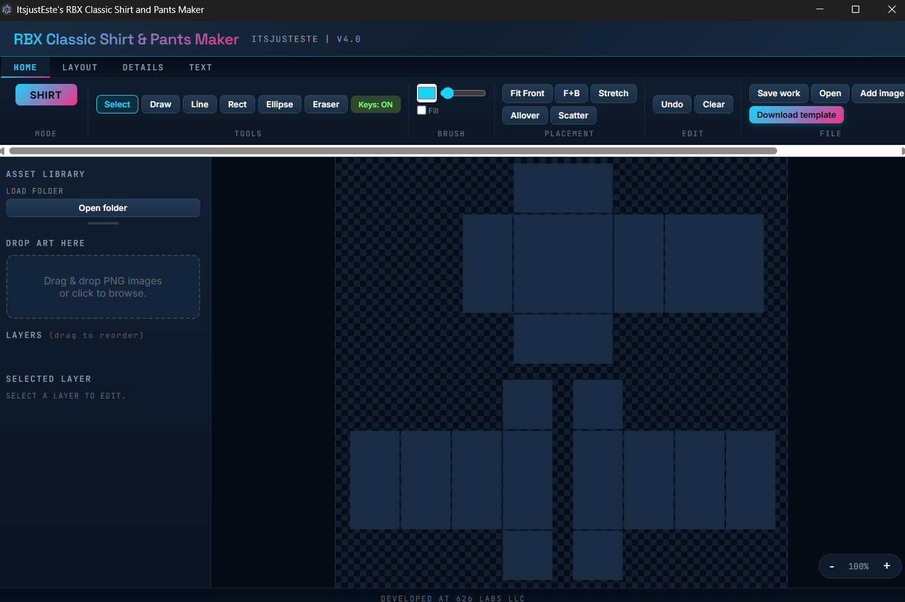
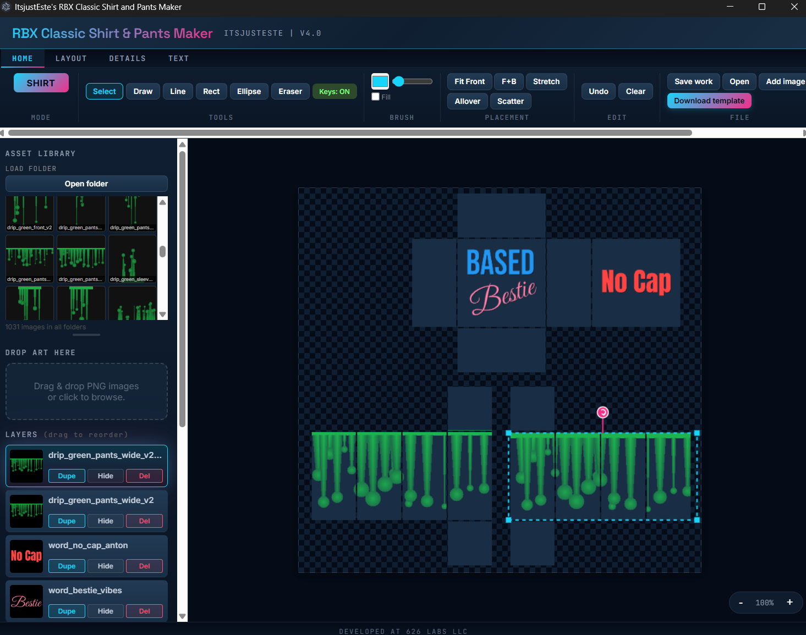
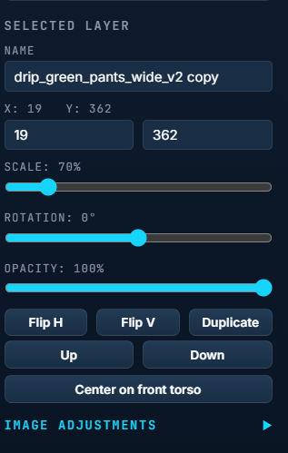
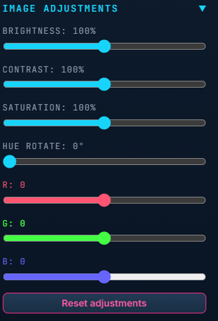
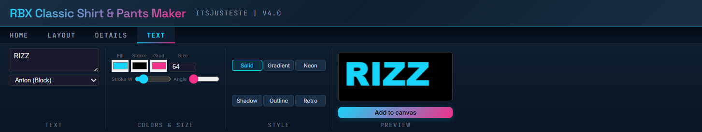
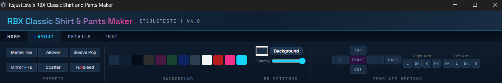
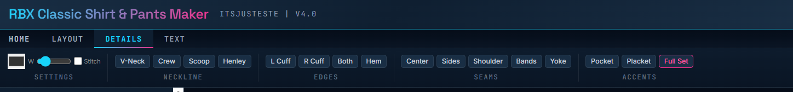

<h1 align="center">ItsjustEste's RBX Classic Shirt and Pants Maker</h1>

<p align="center"><em>Imagine Something Else.</em></p>

<p align="center">
A native desktop editor for Roblox Classic (R15) shirt and pants templates —
layer-based compositing, non-destructive image adjustments, word art, drawing tools,
and a fullscreen canvas built for the exact 585×559 template grid.
</p>

<p align="center">
  <a href="https://github.com/estevanhernandez-stack-ed/RBX15-Shirt-and-Pants/releases"></a>
  <a href="https://github.com/estevanhernandez-stack-ed/RBX15-Shirt-and-Pants/stargazers"></a>
  <a href="LICENSE"></a>
  
</p>

<p align="center">
  <strong>Windows 10 / 11</strong> · <strong>Electron</strong> · <strong>v4.0.0</strong>
</p>

<p align="center">
<sub>Independent third-party tool. Not affiliated with Roblox Corporation. Roblox is a trademark of Roblox Corporation, used nominatively to describe the output format.</sub>
</p>

<p align="center">
  
</p>

---

## Install

### Windows 10 / 11 — NSIS installer

Download the latest **`ItsjustEste's RBX Classic Shirt and Pants Maker Setup.exe`** from [Releases](https://github.com/estevanhernandez-stack-ed/RBX15-Shirt-and-Pants/releases), click through the SmartScreen "unknown publisher" warning (signing deferred pending Microsoft Store approval), and run the installer.

- Creates desktop + Start Menu shortcuts.
- Installs to your chosen directory (NSIS lets you pick).
- Uninstaller registered in Apps & features.
- **MSIX submission to Microsoft Store is pending** — Store approval eliminates the SmartScreen prompt and unlocks `winget install rbx-maker`.

### Build from source

```bash
git clone https://github.com/estevanhernandez-stack-ed/RBX15-Shirt-and-Pants.git
cd RBX15-Shirt-and-Pants
npm install
npm run build    # produces dist/ with the installer
```

### Development mode

```bash
npm install
npm start        # launches Electron with hot-reload disabled
```

Requires **Node.js 18+** and **Electron 41**.

---

## A quick tour

<table>
  <tr>
    <td align="center" width="50%"><br><strong>Layers panel</strong><br><sub>big thumbnails, labeled Dupe / Hide / Del buttons</sub></td>
    <td align="center" width="50%"><br><strong>Image adjustments</strong><br><sub>brightness, contrast, saturation, hue — real-time</sub></td>
  </tr>
  <tr>
    <td align="center" width="50%"><br><strong>Per-channel RGB shift</strong><br><sub>pixel-level tint without touching the source</sub></td>
    <td align="center" width="50%"><br><strong>Word art generator</strong><br><sub>15 fonts, six styles, live preview</sub></td>
  </tr>
  <tr>
    <td align="center" width="50%"><br><strong>Layout tab</strong><br><sub>presets, backgrounds, template regions</sub></td>
    <td align="center" width="50%"><br><strong>Details tab</strong><br><sub>collars, cuffs, hems, seams, pockets, plackets</sub></td>
  </tr>
</table>

---

## Features

### Compositing

- **Layer-based editor** — drag to reorder, duplicate, hide, or delete. Each layer keeps independent transform and adjustment state.
- **On-canvas transform** — move, scale, and rotate with corner handles and a dedicated rotation handle. Scroll-wheel scales; arrow keys nudge; hold Shift for bigger steps.
- **Asset library browser** — point at a folder, get a thumbnail grid. Drag any thumbnail to the canvas and it lands where you drop it. Click to add at the default torso spot. Right-click for full-bleed scale.
- **Word art generator** — 15 Google Fonts, six styles (solid, gradient, neon, shadow, outline, retro), live preview, adjustable stroke and angle.
- **Drawing tools** — pen, line, rectangle, ellipse, and eraser. Strokes auto-crop to tight bounding boxes on commit.

### Adjustments

- **Non-destructive image adjustments** — brightness, contrast, saturation, hue rotate, plus per-channel RGB shift. Every slider renders in real time.
- **Reset in one click** — restores all adjustments to defaults without touching the source image.
- **Baked on export** — adjustments are applied when you hit **Download Template** so the final PNG matches what you see on canvas.

### Roblox-specific

- **Exact R15 grid** — 585×559 canvas, precise torso / arm / leg / waist regions, live mask overlay so you can see what will actually show on the model.
- **Mode toggle** — switch between **Shirt** and **Pants** templates. Regions swap accordingly.
- **Placement presets** — *Fit Front*, *Front + Back*, *Stretch*, *Allover*, *Scatter*, and layout presets (*Meme Tee*, *Mirror F+B*, *Fullbleed*).
- **Clothing details** — auto-generate collars (V-neck, crew, scoop, henley), cuffs, hems, seams, pockets, plackets, shoulder stripes, arm bands, and yokes.
- **Region color fills** — click any region button to paint it a flat color. Right-click to clear.

### Workflow

- **Save Work** → `.r15proj` JSON file. Reopen and keep editing with layers, adjustments, positions, and region colors preserved.
- **Download Template** → 585×559 PNG ready to upload to Roblox.
- **Undo** — 30-step history. Ctrl+Z bound.
- **Full keyboard shortcuts** — `V` / `B` / `L` / `U` / `O` / `E` for tools, arrows to nudge, `[` / `]` to rotate, `+` / `-` to scale, `Delete` to remove, `Ctrl+D` to duplicate. Toggle with the **Keys: ON** indicator.

### Privacy & control

- **No telemetry, no analytics, no ads.** The app makes zero network requests. Everything runs locally.
- **All files stay on disk.** Project files save where you tell them to. Images load from your filesystem or the asset library folder you point at.
- **No account required.** No sign-in. No cloud.

---

## Controls

| Action | Effect |
|--------|--------|
| Click asset thumbnail | Add as layer at default torso position |
| Drag asset thumbnail to canvas | Add as layer at drop position |
| Right-click asset thumbnail | Add at full-template scale |
| Scroll wheel on selected layer | Scale up / down |
| Arrow keys | Nudge selected layer (Shift = 10px) |
| `[` / `]` | Rotate 5° counter-clockwise / clockwise (Shift = 15°) |
| `R` | Reset rotation |
| `+` / `-` | Scale selected layer |
| `Delete` / `Backspace` | Remove selected layer |
| `Ctrl+D` | Duplicate selected layer |
| `Ctrl+Z` | Undo |
| `V` / `B` / `L` / `U` / `O` / `E` | Select / Pen / Line / Rect / Ellipse / Eraser |

---

## Docs

- Landing page — *coming with docs/ submission PR*
- [Changelog](CHANGELOG.md) — *coming with CHANGELOG PR*
- [Contributing](CONTRIBUTING.md) — *coming with CONTRIBUTING PR*
- [Security policy](SECURITY.md) — *coming with SECURITY PR*
- Privacy policy — *coming with PRIVACY PR*

---

## Roadmap

### Shipped in v4.0

- [x] Monolith decomposition (single HTML → `editor.html` + `styles.css` + `editor.js`)
- [x] Non-destructive image adjustments (brightness, contrast, saturation, hue, RGB channels)
- [x] Canvas drop positioning (images land where you drop them)
- [x] Redesigned layer panel (larger thumbnails, labeled action buttons)
- [x] Evolved UI (gradient depth, hover glows, tightened ribbon labels)
- [x] Asset browser drag-to-canvas name preservation
- [x] Render performance pass (cached offscreen canvas, cached RGB shift results)

### Up next

- [ ] 626 Labs design system pass — swap cyberpunk palette to brand navy / cyan / magenta
- [ ] Microsoft Store MSIX submission (in prep)
- [ ] Landing page at [626labs.dev](https://626labs.dev)
- [ ] Code signing for Windows binary
- [ ] Test plan + release notes
- [ ] Privacy policy + security policy
- [ ] Accessibility pass
- [ ] Historical versions browser (open any saved `.r15proj` as a starting point)

---

## Why "RBX Classic"?

Roblox has two avatar systems: **Classic** (the traditional 2D flat-panel shirts and pants uploaded as PNGs) and **Layered Clothing** (3D mesh garments). This tool builds templates for the former — the 585×559 R15 mapping that ships with every Roblox account and still dominates marketplace listings.

---

## License

MIT — do whatever you want with it. Built by [626 Labs LLC](https://626labs.dev).

Part of the 626 Labs product family. Find other tools at [626labs.dev](https://626labs.dev).

<p align="center">
  <sub>
    "Roblox" and the Roblox logo are trademarks of Roblox Corporation, used nominatively to describe the output file format. ItsjustEste's RBX Classic Shirt and Pants Maker is an independent third-party tool.
  </sub>
</p>
